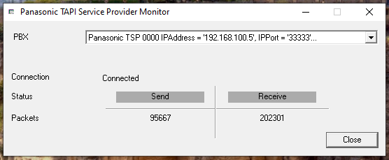
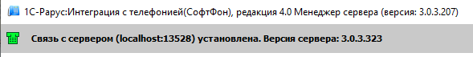

На сервере 192.168.100.3 проверить доступность **ATC**. Это можно сделать с помощью утилиты

{width=556px height=229px}

В случае если **Connected**, тогда сервер соединен.

Далее переходим в 1С-Рарус и выбираем Интеграция с телефонией.

{width=589px height=71px}

Если указано что связь с сервером установлена, то все в порядке.