## **Данное руководство создано в целях обучения и приобретения навыков в обновлении программных продуктов 1С.**

Наша компания занимается поддержкой различных продуктов компании “1С” такие как - платформа 1С Предприятие, Бухгалтерия предприятия (ПРОФ, Базовая, КОРП), Бухгалтерия некоммерческой организации, Зарплата и Кадры государственного учреждения (ПРОФ, Базовая, КОРП) и другие. Ниже представлен рисунок с задачами обновления и вид на наше рабочее место, под названием УНФ (Управление Нашей Фирмой).

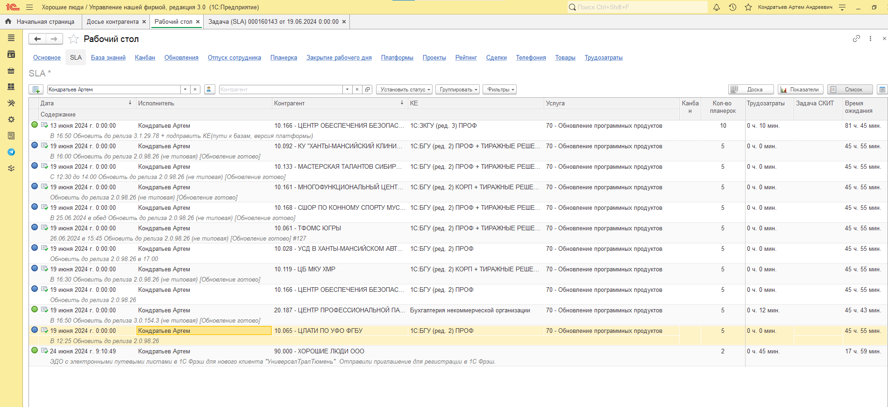{width=1901px height=873px}

Обновления делятся на два вида: **типовые и не типовые**. Отличия в том, что типовые обновления идут “из коробки“, а не типовые дорабатываются нами, чтобы внедрить определенные наработки клиенту. Чтобы узнать какое именно обновление, необходимо смотреть на саму задачу. Вот так выглядит **типовая** задача:\
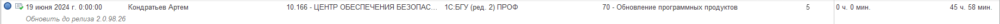{width=1841px height=45px}

А вот так **не типовая:**

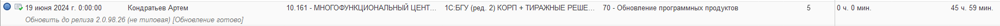{width=1838px height=48px}

Стоит отметить, что не типовое обновление представляет собой релиз, который определённый специалист готовит вручную, **поэтому вам необходимо будет ждать надпись “Обновление готово“ и только потом приступать к обновлению у клиента.**

## **Рассмотрим первый вариант, а именно типовые обновления:**

1. Переходим в саму задачу кликнув дважды ЛКМ по задаче. Перед вами откроется интерфейс, в котором будет много различных кнопочек и данных, но понадобятся нам не все.

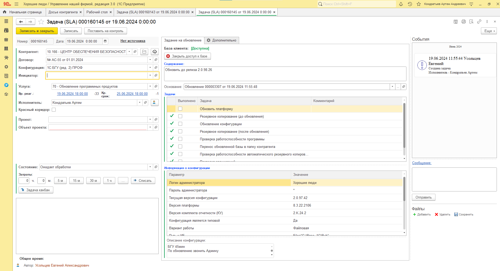{width=1913px height=1039px}

В первую очередь посмотрите на конфигурацию и содержание - в них написано какой программный продукт и до какой версии вам необходимо обновиться.

Далее проверьте, есть ли данный релиз в общей папке на нашем сервере перейдя по данному пути (\\192.168.100.2\\20 - хорошие люди\\10 - ХРАНИЛИЩЕ\\20.2 - ОБНОВЛЕНИЯ\\1С). В самом конце данной папки, есть файлик с расшифровкой названий папок. Исходя из этой подсказки, перейдите в нужную папку, например Бухгалтерия Государственного Учреждения (StateAccounting 2.0).

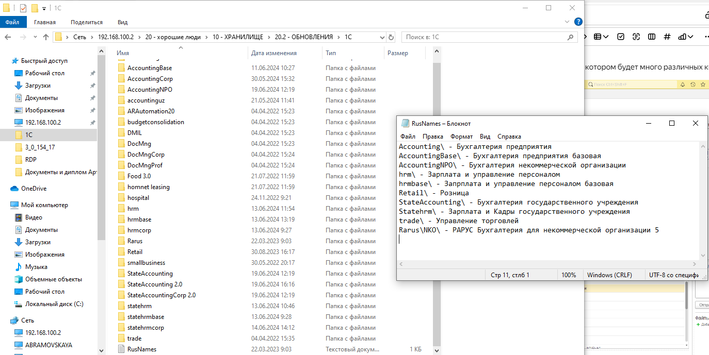{width=1374px height=689px}

Обычно обновление закидывается в тот момент, когда вам прилетают задачи, но убедиться всё же нужно, что новый релиз на месте, иначе говорить об отсутствии релиза Усольцеву Евгению. Как мы видим, новый релиз на месте.

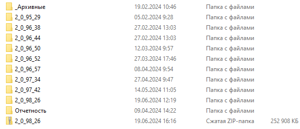{width=603px height=261px}

1. Далее вам необходимо выбрать человека, которому нужно будет позвонить и сообщить об обновлении. Обычно выбирается главный бухгалтер, его заместитель или человек, который описан в конфигурационной единице (КЕ). В строке “Инициатор“ нажмите на выпадающий список, найдите нужного человека и выберите его.

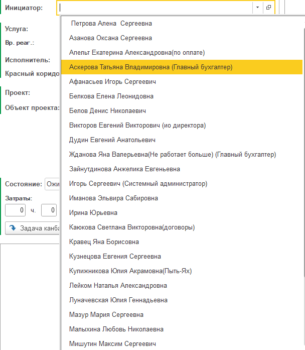{width=608px height=697px}

После этого появятся номера телефонов данного человека.

{width=559px height=92px}

1. Если вы подключены к общей телефонии, то нажимайте на кнопку телефона, после чего начнется звонок в данную организацию. Если вам отвечает автоответчик и просит ввести добавочный номер сотрудника (который написан рядом с основным номером), то введите его на физической клавиатуре телефона. После ждите ответа сотрудника.

2. Как только с вами поздоровались, скажите следующие слова: “Здравствуйте, меня зовут \[ваше имя\], компания Хорошие Люди. Звоню по поводу обновления \[тип обновления\], когда вам будет удобно обновиться?“ Клиент скажет вам “можно сейчас”, “в обед” или в определённое время. **ОБЯЗАТЕЛЬНО УТОЧНЯЙТЕ ВО СКОЛЬКО ОБЕД**, так как у разных организаций по-разному. Если вы назначали на определённое время, то можно записать его себе прямо в задачу, чтобы не забыть.

3. В любом случае следующий шаг, если клиент согласился на обновление, это выбор подключения. Его вы можете посмотреть в КЕ. Есть основные программы, которые мы используем: AnyDesk, Ассистент, RDP, 1C-Коннект, RMS Viewer, VPN + RDP. В основном, самый популярный метод - это AnyDesk. Спрашивайте у клиента номер рабочего стола и подключаетесь. Всё просто)

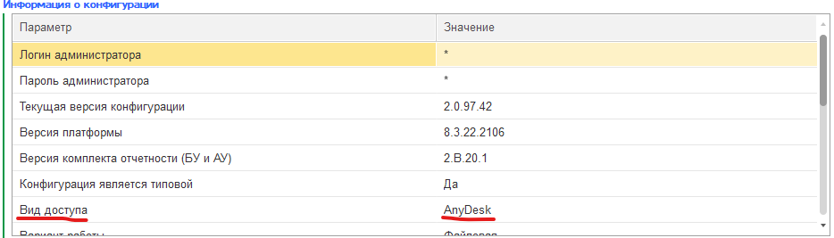{width=934px height=267px}

1. После того как вы подключитесь к клиенту, можете положить трубку поблагодарив его и сказать, что перезвоните . Затем найдите ярылк 1С Предприятие и кликните на него два раза ЛКМ. в данном окне выберите нужную базу (путь базы лежит в КЕ) и запустите “Конфигуратор“.

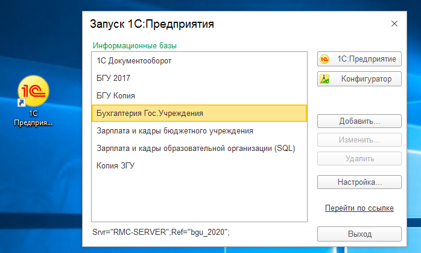{width=698px height=419px}

1. Вас встретит окошко с авторизацией - выберите пользователя “Хорошие люди“ и введите пароль, который я вам скажу позже). Нажмите “Войти“.

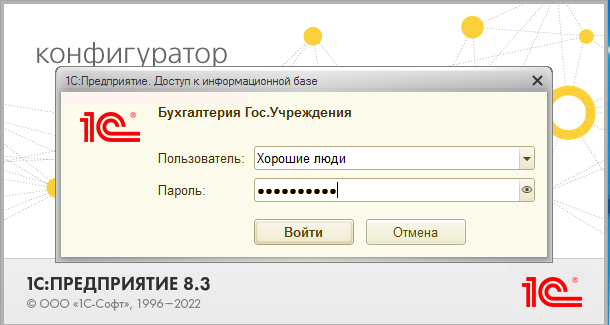{width=610px height=325px}

1. Перед вами откроется “Конфигуратор“ - это оболочка для разработчиков, в которой можно гибко настраивать систему. Перейдите во вкладку “Администрирование“ и нажмите на кнопку “Активные пользователи“. **!!!ВНИМАНИЕ, ПРИ ОБНОВЛЕНИИ БАЗЫ, НЕОБХОДИМО ЧТОБЫ ВСЕ СОТРУДНИКИ ВЫШЛИ ИЗ СИСТЕМЫ!!!** иначе, ничего не получится)

Идеальный вариант приведен ниже - в списке должен быть только пользователь “Хорошие люди“ в приложении “Конфигуратор“

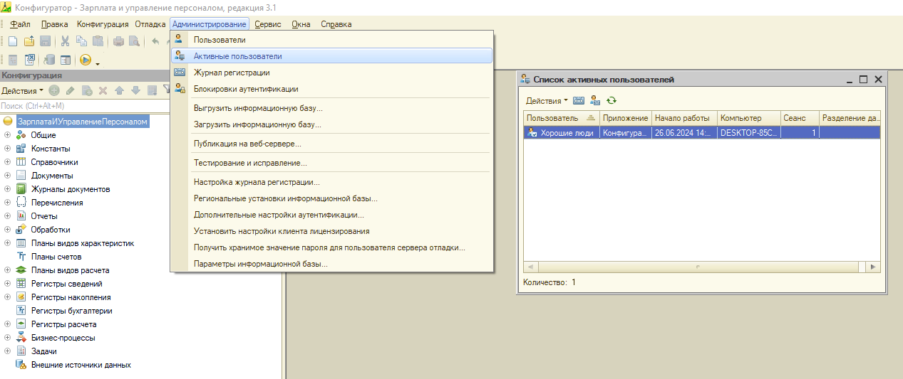{width=1267px height=533px}

1. После того, как вы убедились в отсутствии пользователей в базе, переходите к резервному копированию базы. Для этого зайдите в раздел “Администрирование“ и нажмите на кнопку “Выгрузить информационную базу“. Обычно у клиента на диске есть папка под названием “Хорошие люди“, в которой есть несколько других папок. Перейдите в папку “Резервные копии“, нажмите на название нужной вам резервной копии и поменяйте дату резервной копии и время. Нажмите на кнопку “Сохранить”.

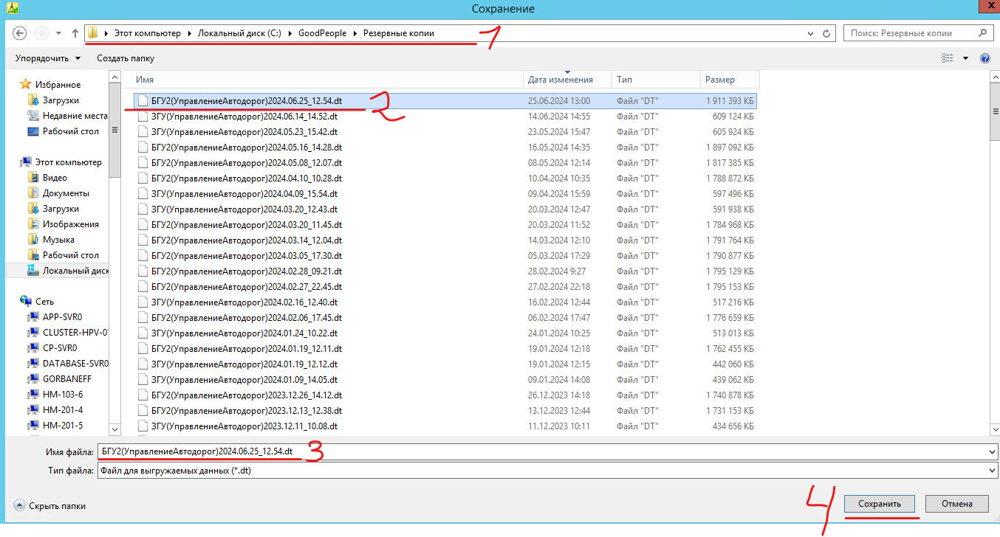{width=1354px height=728px}

1. После, дождитесь выгрузки базы и появления окна “Выгрузка успешно завершена“.

2. Далее вам необходимо перенести нужное обновление из общей папки обновлений (\\192.168.100.2\\20 - хорошие люди\\10 - ХРАНИЛИЩЕ\\20.2 - ОБНОВЛЕНИЯ\\1С) в папку “Хорошие люди/Обновления“ на устройстве клиента. Архивируйте папку с обновлением и перекидывайте с помощью CTRL+C, CTRL+V. Если размер обновления слишком большой или время копирования слишком долгое, тогда используйте любое облако (Mega, Yandex Диск).

3. В конфигураторе переходите во вкладку “Конфигурация“, “Поддержка“ и нажмите на кнопку “Обновить конфигурацию“.

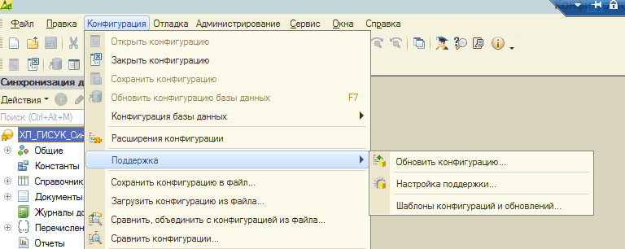{width=768px height=306px}

1. Перед вами откроется окно “Обновление конфигурации“. Выбирайте способ источника ““Поиск доступных обновлений”, нажимайте “Далее“. Убедитесь, что стоит галочка на “Искать обновления в каталогах“ и имеется путь до папки обновлений среди списка. Далее нажимайте “Готово”, далее и другие кнопки, которые будут вас вести вперед)

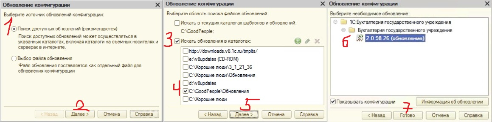{width=1159px height=289px}

1. Далее просто ждите конца обновления, в окошках нажимайте “Далее“, “Готово“ и прочее.

2. После того как появится окно “Обновление конфигурации завершено“, нажмите “ОК“ и нажмите на кнопку “Запустить отладку”.

3. Далее нажмите “Да“ в появившемся окне “Обновление базы данных“

4. Начнется процесс обновления баз данных, после чего откроется 1С Предприятие и предложит вам обновить программу до нового релиза. Поставьте галочку и нажмите “Далее“.

5. После обновления заходите в меню 1С Предприятия (рядом с вашем именем), и нажмите кнопку “О программе“. Здесь вы увидите новую версию программы, путь к базе и тд. Нажмите строку “Информация для технического специалиста” внизу этого окна. И далее смотрите на расширения (!!! ПОСЛЕ ОБНОВЛЕНИЯ НЕОБХОДИМО ВСЕГДА ПРОВЕРЯТЬ РАСШИРЕНИЯ НА ОШИБКИ!!!). Если вы увидели ошибку о том, что расширение не активно и уровень ошибки низкий, то ничего страшного, иначе в любом другом случае зовите на помощь 😁

6. Так же, зайдите в настройки нажав на шестерню слева в интерфейсе (Администрирование), далее заходите в “Обслуживание“ - раздел “Обновление программы“, нажмите на “Результаты обновления и дополнительная обработка данных“. Дождитесь завершения дополнительных обработок, если они будут, после чего вы должны увидеть вот такое окно, которое вам сообщит, что всё успешно завершено (**!!!ВСЕ ГАЛОЧКИ ДОЛЖНЫ БЫТЬ ЗЕЛЕНЫМИ!!!**). После чего можно спокойно всё закрывать и звонить клиенту об успешном обновлении.

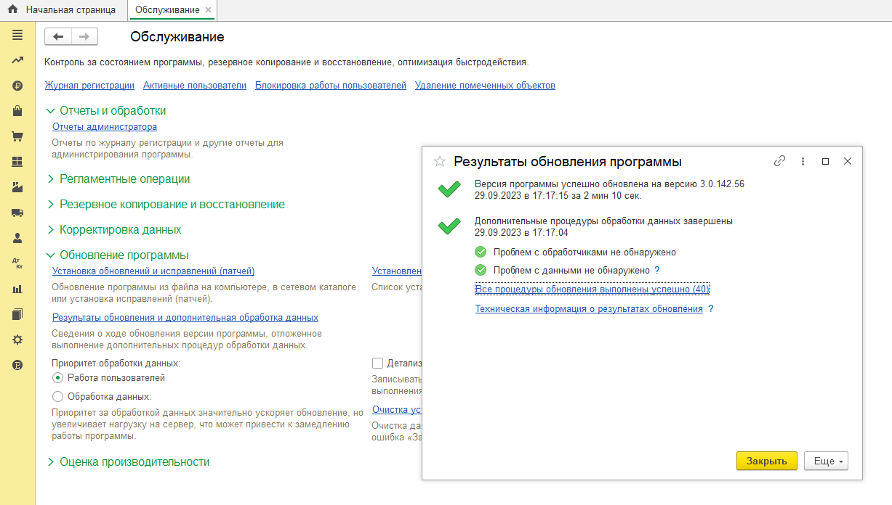{width=1227px height=696px}