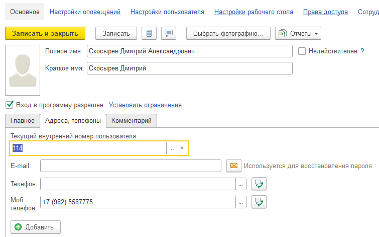
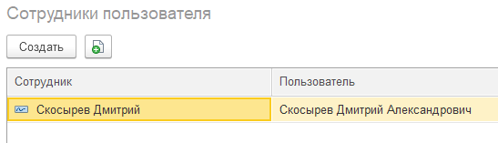

Пункт 1. Зайти в 1С с правами администратора

Пункт 2. Открыть Настройки -> Настройка пользователей и прав -> Пользователи

Пункт 3. Создать пользователя и заполнить обязательно реквизиты **Текущий внутренний номер пользователя, Моб телефон**

{width=755px height=471px}

Пункт 4. На вкладке настройка пользователя выбрать Использовать **СофтФон = ДА** (Если пользователь будет пользоваться телефоном)

Пункт 5. Выбрать права доступа **Базовые права1, Управление заданиями, Управление проектами, Франчайзи**

Пункт 6. На вкладке Сотрудники пользователя должна присутствовать ОДНА запись

{width=547px height=157px}

Пункт 7. В справочнике найти сотрудника с данным ФИО и поставить галочку в строке **ДЕЙСТВУЮЩИЙ** пункта Адреса, телефоны, так же выбрать Группу соответствующую данному сотруднику.

Пункт 8. Через все функции зайти в справочник **Структура отделов** и добавить нового пользователя в папку соответствующую отделу где будет работать сотрудник.

После применения настроек нужно перезапустить Рабочий стол УНФ.