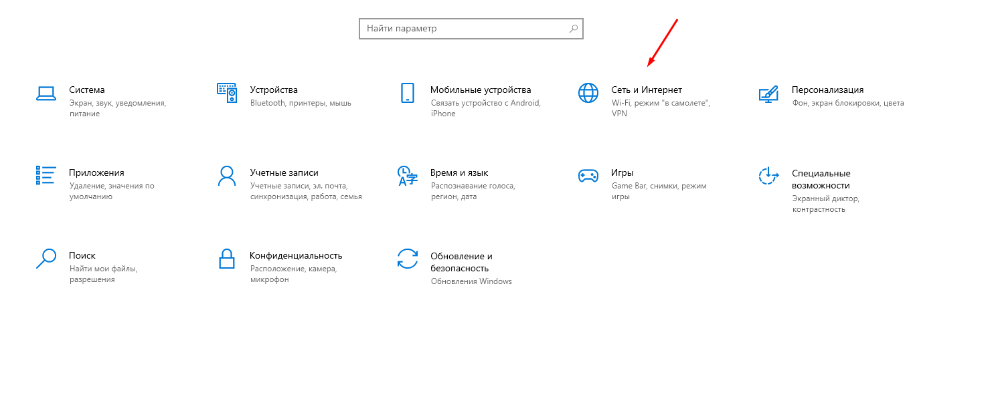
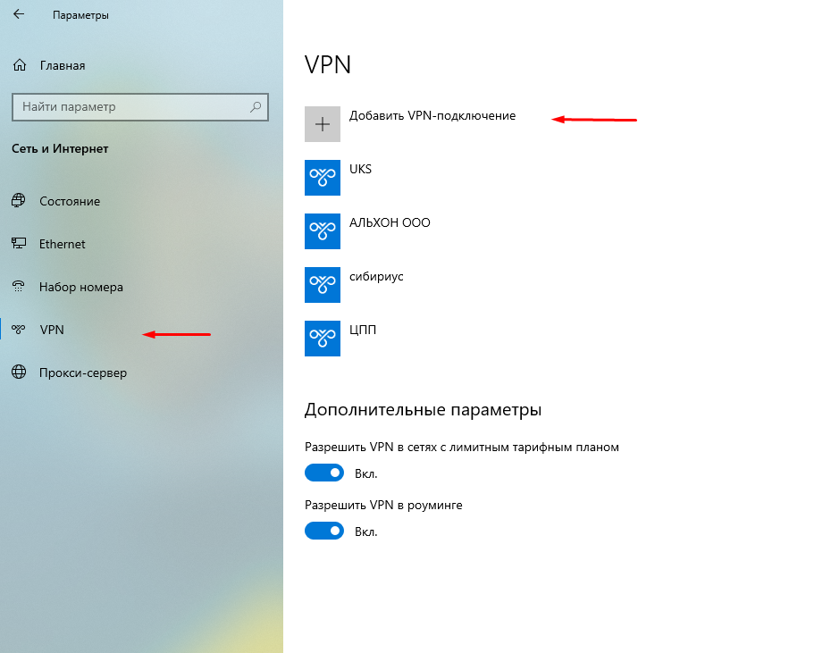
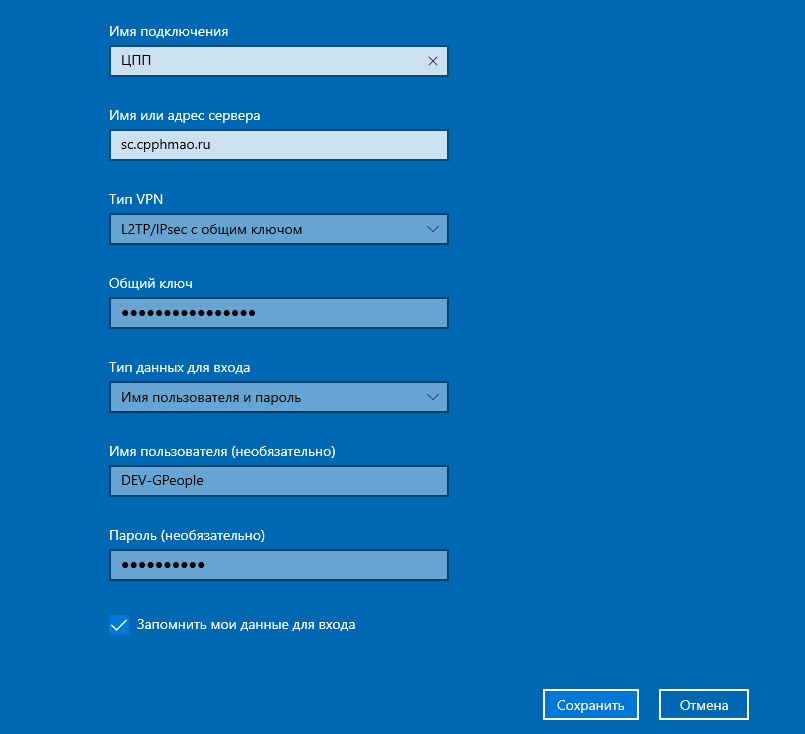
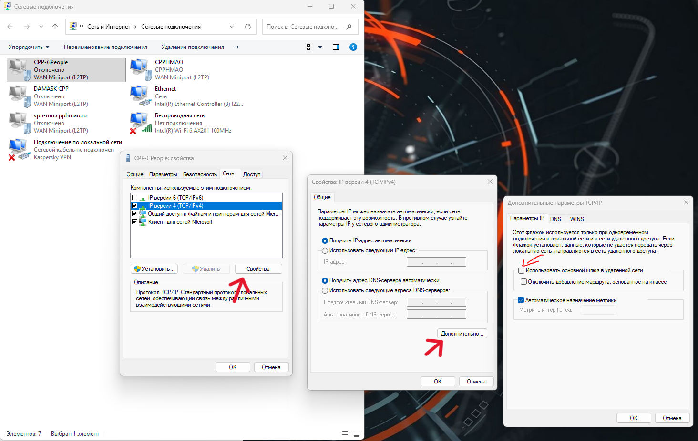

#### Настройка VPN для подключения на сервер

Пуск > Параметры > Сеть и Интернет > VPN

#### Добавляем VPN-Подключение

Имя Подключения: (Любое удобное вам)

Имя или адрес сервера: [sc.cpphmao.ru](http://sc.cpphmao.ru)

Тип VPN: L2TP/IPsec с общим ключом

Общий ключ: [cpphmao.ru](http://cpphmao.ru)

Имя пользователя: DEV-GPeople

Пароль: Kx2hd@ijkFhjsa78sd

### или таблицой оставить?



---

*  Имя Подключения

*  (Любое удобное вам)

---

*  Имя или адрес сервера

*  [sc.cpphmao.ru](http://sc.cpphmao.ru)

---

*  Тип VPN

*  L2TP/IPsec с общим ключом

---

*  Общий ключ

*  [cpphmao.ru](http://cpphmao.ru)

---

*  Имя пользователя

*  DEV-GPeople

---

*  Пароль

*   Kx2hd@ijkFhjsa78sd



#### нажимаем кнопочку сохранить

#### Картинки

{width=1494px height=618px}

{width=930px height=731px}

{width=805px height=734px}

После этого нажимаем Win+R > вводим «ncpa.cpl» > Enter

находим ЦПП в списке нажимаем ПКМ > Свойства

{width=1464px height=928px}