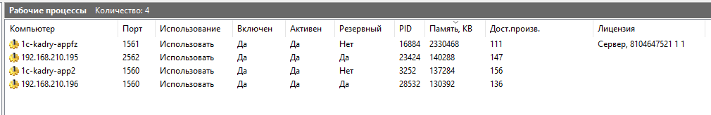
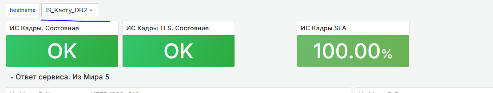

При возникновении нештатной ситуации - не паникуйте! Действуйте!

Подключиться на сервер **192\.168.210.181** через наш шлюз **192\.168.100.160** и в Администрировании серверов 1С зайти на вкладку **Рабочие процессы** и посмотреть все ли серверы 1С сейчас трудятся. На картинке показана только одна лицензия - ЭТО НОРМА. Потому что механизм платформы подключит лицензию если на нем будет выполняться КОД КЛИЕНТА (не фоновые задания, а именно клиент), а для этого нужно чтобы центральный сервер решил что у него недостаточно мощности и потрубит рабочий сервер для вычислений, такое происходит когда нагрузка растет. Если не верите, то есть ИТС. Читайте!

В идеале каждый сервер должен быть ВКЛЮЧЕН и АКТИВЕН. Если не АКТИВЕН, то на данном сервере проверить работает ли служба 1С. Доступная производительность не должна стремиться к 0.

{width=1010px height=164px}

Если ГИС тормозит надо сразу проверить сервер СУБД. Подключиться можно через утилиту putty на сервере 192.168.210.195. При подключении используйте логин 1chr и секретный пароль YEvP4r@n (я его удалю когда вернусь из отпуска). Далее выполнить команду **sudo su** и снова набрать этот же логин и пароль. Далее пишем htop и смотрим есть ли дикая нагрузка.

Еще в деле нам поможет мониторинг. Перейти по ссылке <https://grafana.uriit.ru> и набрать **giskadry / 5jksOGzeNX** . Откроется интерфейс где нужно выбрать наши серверы сверху галочками. Нас больше всего будут интересовать **db2 - субд, app - рабочий сервер, app2 - рабочий сервер, appfz - центральный сервер**.

{width=1110px height=212px}

Конечно же смотрите за тем чтобы дисковое пространство не стремилась к **НУЛЮ.**

Понаблюдайте через диспетчер задач не потребляет ли антивирус слишком много оперативной памяти и цп одновременно (Либо может только оперативка).

Бэкапчики всегда делаются на сервере СУБД в папке /mnt/disk2/backup1c/statehrmcorp. Без надобности не восстанавливайте, есть нюансы.

Так же есть бэкапчики в DT. Они хранятся на сервере 192.168.210.182 в папке на диске D. Думаю тут сможете найти, они делаются 1 раз в 9 часов вечера.

Если есть клиенты у кого не запускается программа, то тут нужно анализировать что случилось. Например у кого то не запускается потому что в TLS нет доступа к ресурсам, но тут понятно что проблема не наша и только СКИТ им поможет, но если дико тормозит тогда придется разбираться. Причин быть может куча: слабый интернет , кэш браузера или нечто иное.

Конечно стоит заметить что если потребуется создать пользователя для ГИС УК, тогда знайте что это делает ДЕНИС РЯДНОВ. Инструкции ему известны лично.

Отличный механизм расследования торможений это APDEX . Он находится в разделе **Администрирование -> Обслуживание -> Отчеты администратора**. Выбрать нужно отчеты **Оценка производительности по ключевым параметрам**. Выберете фильтр Открытие форм и