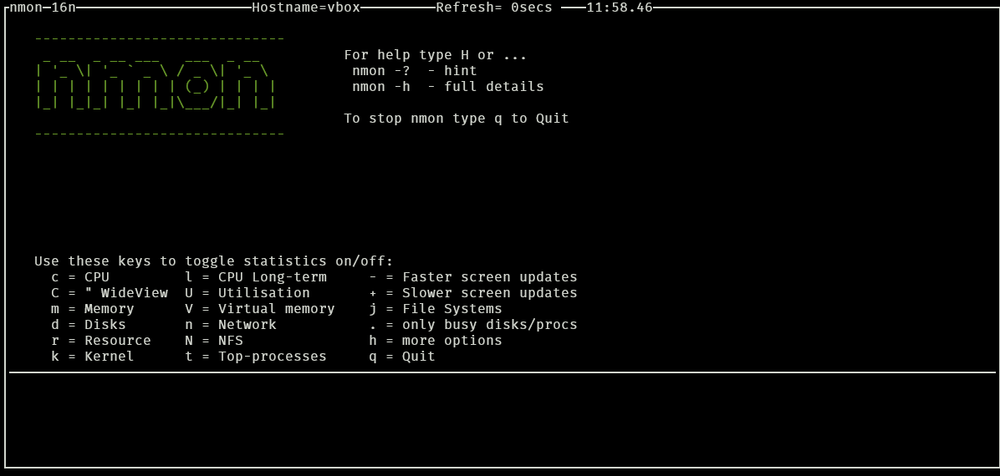

## NMON

### Установка:

-  Debian/Ubuntu/Astra - `sudo apt install nmon`

-  Fedora/RedHat/RedOS - `sudo dnf install epel-release && sudo dnf install nmon`

### Использование:

**Мониторинг в реальном времени:**

Для мониторинга ресурсов системы в реальном времени запускаем nmon при помощи команды `nmon` ~~(удивительно)~~.

{width=1196px height=570px}

После этого отобразится такое окно со справкой по ресурсам мониторинга.

:::quote 

Для отображения информации по определенному ресурсу используются следующие клавиши:

-  **c = CPU** - Показывает нагрузку каждого ядра процессора и среднюю нагрузку процессора, загруженность системой, пользователем и ожидание.

-  **m = Memory** - Показывает общее количество оперативной памяти, занятой в мегабайтах и процентах, файла подкачки, кэшированной памяти, буфера и другу информацию о состоянии памяти.

-  **d = Disks** - Показывает информацию о состоянии дисков и их разделов (информация файла /proc/diskstats). Информация представлена в виде таблицы и графика, в котором показаны имя физического диска и томов, количество занятой памяти, текущее чтение и запись с раздела диска (в килобайтах), для каждого раздела существует график со шкалой от 0 до 100 процентов, для визуальной наглядности загруженности дисков. Также присутствует информация о суммарной скорости чтения и записи.

-  **r = Resources** - Показывает информацию о версии и типе ядра, процессоре, архитектуре компьютера, операционной системе и ее версии.

-  **k = Kernel** - Показывает информацию о ядре в виде таблицы, запущенных очередях, форках, прерываниях, переключениях. Также показывает среднюю нагрузку, холостой ход, длительность полной работы системы и средней нагрузки ядра на процессор.

-  **j = Filesystems** - Показывает информацию о файловой системе в виде таблицы, имя раздела (путь к папке), полный размер (MB), свободное и занятое место (MB), тип файловой системы и точка монтирования.

-  **n = Network** - Показывает информацию о сетевых интерфейсах, количестве и размеру отправленных/полученных пакетов, также уведомляет об сетевых ошибках в виде аккуратной таблицы.

-  **N = NFS** - Показывает информацию о сетевой файловой системе (NetworkFileSystem), загруженности сети, клиентом и сервером, в моем случае NFS версии 2 и 3.

-  **t = Top processes** - Показывает список процессов в виде таблицы (очень похоже на команду top), столбцы: PID процесса, нагрузка на процессор, количество занятой оперативной памяти и т. д.

-  **V = Virtual memory** - Показывает информацию о виртуально памяти, в частности о разделе подкачки.

-  **v = Verbose hints** - Показывает информацию о ресурсах в плане безопасности, степень предупреждения и опасности (в процентах).

-  **l = CPU long-term** - Показывает наглядный график загруженности процессора.

*С ресурса* [*nmon -- База знаний РедОС*](https://redos.red-soft.ru/base/redos-7_3/7_3-administation/7_3-processes/7_3-monitoring-proc/7_3-dynamic-monitoring-proc/7_3-nmon/)

:::

### Для подробного изучения:

1. [Простой, надёжный и удобный мониторинг серверов на Linux](https://habr.com/ru/companies/ruvds/articles/324194/) - Habr