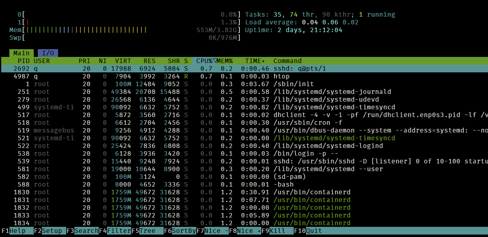

`htop` -- Утилита для мониторинга ресурсов и управления процессами

## Установка:

-  Debian/Ubuntu/Astra - `sudo apt install htop`

-  Fedora/RedHat/RedOS - `sudo dnf install htop`

## Использование:

Для запуска используется команда `htop`

После запуска выведется такое меню

{width=1201px height=583px}

 

## Для более глубокого изучения

1. [htop -- База знаний РЕДОС](https://redos.red-soft.ru/base/redos-8_0/8_0-administation/8_0-processes/8_0-monitoring-proc/8_0-dynamic-monitoring-proc/8_0-htop/?sphrase_id=1070193)