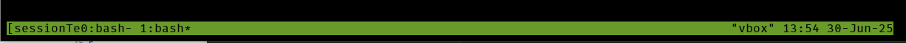

`tmux` *(terminal multiplexer)* -- *свободная консольная утилита-мультиплексор*, предоставляющая пользователю доступ к нескольким терминалам в рамках одного экрана.

## Установка:

-  Debian/Ubuntu/Astra - `sudo apt install tmux`

-  Fedora/RedHat/RedOS - `sudo dnf install tmux`

## Использование:

### Запуск:

Чтобы просто запустить tmux и начать работу с ним необходимо просто прописать команду `tmux` в терминал, после установки. Но чтобы создать новую сессию с определенным именем необходимо прописать команду `tmux new -s <имя_сессии>` 

{width=1226px height=60px}

После запуска tmux вы увидите как терминал очистился и внизу появилась панель с основной информацией о сессии

### Работа с окнами и панелями:

Перед тем как перейти к описанию команд для работы с окнами и панелями необходимо понять как работают команды в tmux.

Для выполнения команды нужно перед эти нажать и отпустить префикс, по-умолчанию `<C-b>` (CTRL+b), а уже потом нажимать клавишу команды (например, чтобы отключиться от сессии необходимо нажать сначала `<C-b>`, а уже потом `d`)

#### **Список команд для работы с окнами и панелями в tmux:**

:::quote 

*Новое окно (нажать CTRL+b, затем нажать с)*

`<C-b c>`

*Список окон*

 `<C-b w>` 

Переключение 

`<C-b n>` *// следующее окно* 

`<C-b p>` *// предыдущее окно* 

`<C-b 0>` // переключиться на номер окна

**Окна можно делить на панели (Panes) Как в тайловых (мозаичных) оконных менеджерах.**

*Деление окна горизонтально*

 `<C-b ">` 

*Деление окна вертикально*

`<C-b %>` 

*Переход между панелей* 

`<C-b стрелки курсора>` 

*Изменение размеров панелей* 

`<C-b c-стрелки>` 

*Закрытие окон* 

`<C-b x>` 

*Отключение от сессии*

`<C-b d>`

:::

## Для углубленного изучения:

1. [Шпаргалка по работе с Tmux (терминальный мультиплексор)](https://habr.com/ru/articles/327630/) -- Habr

2. [Менеджер терминалов tmux](https://redos.red-soft.ru/base/redos-7_3/7_3-administation/7_3-console/7_3-term-multipleksors/7_3-tmux/) -- База знаний РЕДОС