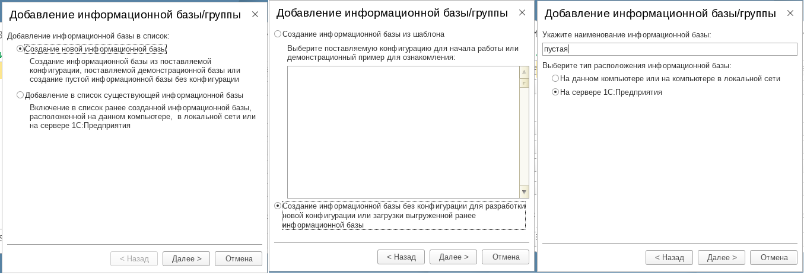
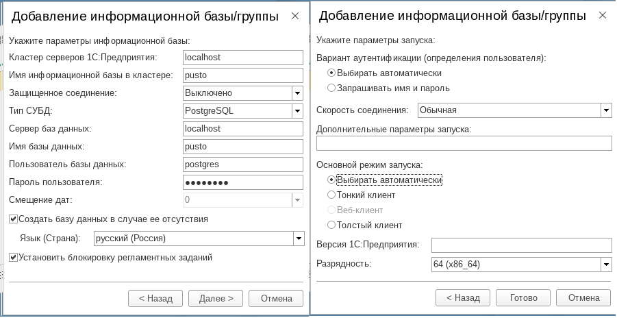
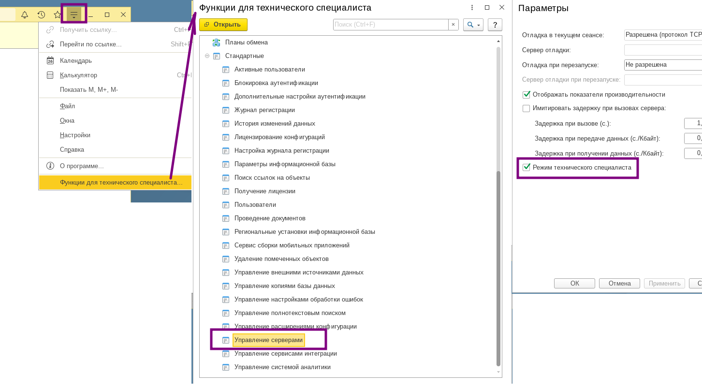
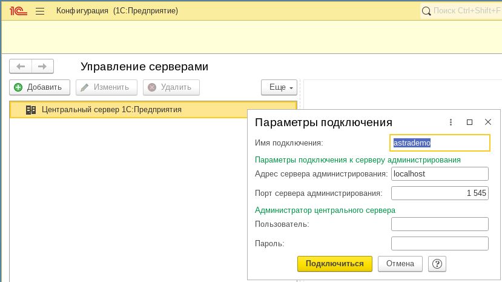
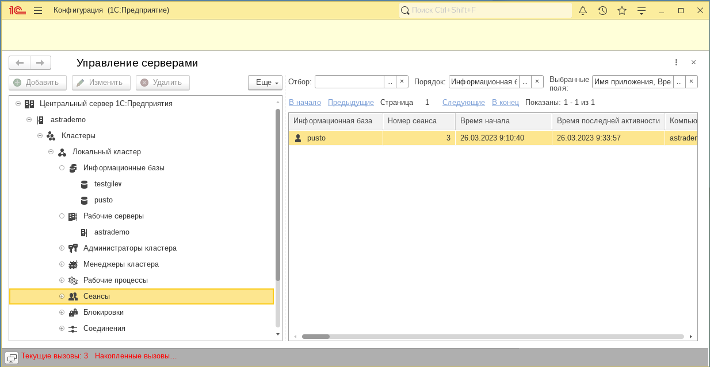

В ОС Линукс отсутствует привычная нам панель администрирования серверов 1С. Для того чтобы иметь возможность работа с соединениями и с базами требуется:

{width=1355px height=464px}

{width=901px height=464px}

Далее нужно включить в пустой базе Функции технического специалиста и открыть обработку Управление серверами.

{width=1452px height=803px}

В обработке выбираете соединения с нужным сервером

{width=829px height=465px}

{width=1234px height=640px}