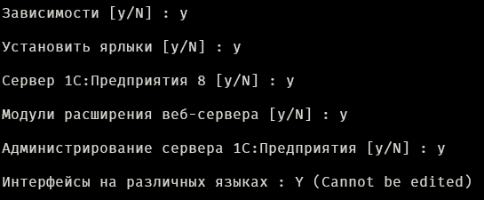

После первичной настройки сервера (см. [Первичная настройка сервера](https://wiki.yandex.ru/homepage/texnicheskie-voprosy/linux-server/pervichnaja-nastrojjka-servera/)) необходимо выполнить установить 1С-сервер, а также запустить и настроить администрирование.

## [**Шаг №1 Копирование файлов установочника**](https://wiki.yandex.ru/homepage/texnicheskie-voprosy/linux-server/setupandconfiguring1cserverandras/#shag-1-kopirovanie-fajlov-ustanovochnika)

**Шаг №1 Копирование файлов установочника**

Первым делом нужно скопировать файлы установочника, тут действуйте исходя из способа подключения.

## [**Шаг №2 Установка**](https://wiki.yandex.ru/homepage/texnicheskie-voprosy/linux-server/setupandconfiguring1cserverandras/#shag-2-ustanovka)

**Шаг №2 Установка**

## [**Разархивируем установочник**](https://wiki.yandex.ru/homepage/texnicheskie-voprosy/linux-server/setupandconfiguring1cserverandras/#razarhiviruem-ustanovochnik)

**Разархивируем установочник**

Далее, если вы установочник вы скопировали на сервер в виде архива

1. Если вы скопировали на linux дистрибутив 1с-сервера в виде zip архива:

   1. Установите unzip

   `sudo apt install unzip` - Для deb-based систем

   `sudo dnf install unzip` - Для rpm-based систем

   1. Создайте директорию, где будут храниться распакованные файлы

      `sudo mkdir /opt/1cinstaller`

   2. Перенесите туда ваш архив

      `sudo mv /path/to/`[`archive.zip`](http://archive.zip) `/opt/1cinstaller/`

   3. Распакуйте его

      `sudo unzip /opt/1cinstaller/`[`archive.zip`](http://archive.zip)

2. tar.gz

   Если вы оказались продвинутым пользователем, или над вами решили подшутить коллеги и по итогу у вас на руках только tar.gz архив то делаем следующее:

   1. Распаковываем архив в нужную директорию

   `tar -xf archive.tar.gz -C /путь/куда/разархивировать`

## [**Выполняем установку 1с сервера**](https://wiki.yandex.ru/homepage/texnicheskie-voprosy/linux-server/setupandconfiguring1cserverandras/#vypolnyaem-ustanovku-1s-servera)

**Выполняем установку 1с сервера**

### [**Последние подготовительные действия**](https://wiki.yandex.ru/homepage/texnicheskie-voprosy/linux-server/setupandconfiguring1cserverandras/#poslednie-podgotovitelnye-dejstviya)

**Последние подготовительные действия**

После того как мы разобрались с архивом нужно запустить установочный файл.

Для этого переходим в папку, куда вы его распаковали.

```
cd /path/to/1cinstalle
```

Узнать оказались ли вы в той папке можно используя команду `ls`

{width=1232px height=85px}

Если в этой директории есть файл `setup-full-<версия>.run`, поздравляю вы прибыли в нужную директорию.

### [**Установка сервера 1с**](https://wiki.yandex.ru/homepage/texnicheskie-voprosy/linux-server/setupandconfiguring1cserverandras/#ustanovka-servera-1s)

**Установка сервера 1с**

Итак чтобы начать установку нужно просто запустить искомый нами файл сделать это, используя консоль, можно так `./setup-full-<версия>.run`.

{width=731px height=30px}

Если вы используете исключительно терминал, первым делом у вас возникнет окно выбора языка установки. Выбираем тот, который больше нравится ~~если вы не понимаете язык, что выбрали это исключительно ваши проблемы~~.

Не переживайте ~~(не переживете)~~ если выбрали что-то не то просто прервите процесс установки нажатием сочетания клавиш `CTRL+C`

{width=462px height=479px}

Выберем язык по-умолчанию (Русский) нажатием клавиши `Enter`.

После этого вы увидите серию окон, в которых вам предстоит выбрать необходимые компоненты. Чтобы выбрать компонент, просто нажмите клавишу `y` и затем `Enter`. Если компонент вам не нужен, вместо `y` нажмите `n`, после этого так же нажимайте `Enter`.

Конкретно нам потребуются :

{width=466px height=146px}


{width=545px height=225px}

{width=517px height=47px}

{width=578px height=115px}

Если вы уверены в том что выбрали все правильно, то в последнем поле смело вводите `y`, в ином случае вводите `n` и тогда выбор запустится заново

Как только вы выбрали все правильно вводите в поле выбора `y`.


Далее, последует продолжительная установка.

{width=816px height=119px}

Как только появится сообщение

:::quote 

Завершена установка 1С:Предприятие на ваш компьютер.

:::

Можете переходить к запуску службы сервера-1С.

### [**Запуск службы Сервера-1С**](https://wiki.yandex.ru/homepage/texnicheskie-voprosy/linux-server/setupandconfiguring1cserverandras/#zapusk-sluzhby-servera-1s)

**Запуск службы Сервера-1С**

Для того чтобы запустить службу, нам потребуется перейти в каталог, куда установился 1С (используя команду `cd`).

{width=631px height=26px}

Расположение и версия могут отличаться от ваших - пользуйтесь подсказкой консоли (нажимайте клавишу `TAB`)

Когда мы оказались в каталоге, где установлен 1С, прописываем ряд команд:

1. Создаем ссылку в подсистеме инициализации и управления службами, чтобы службу можно было запускать не прописывая путь к ней

```
systemctl link ./srv1cv8-8.3.25.1445\@.service 
```

1. Добавляем службу в автозапуск

```
systemctl enable srv1cv8-8.3.25.1445\@.service
```

1. Запускаем службу (будьте внимательны, убедитесь, что после символа `@` вы или терминал добавили слово `default`).

```
systemctl start srv1cv8-8.3.25.1445\@default.service
```

1. Проверяем запуск службы службы

```
systemctl status srv1cv8-8.3.25.1445\@default.service
```

Если служба актива, значит, вы всё сделали правильно.

{width=1215px height=287px}

Теперь можно перейти к настройке и запуску службы администрирования

## [**Запуск и настройка службы администрирования**](https://wiki.yandex.ru/homepage/texnicheskie-voprosy/linux-server/setupandconfiguring1cserverandras/#zapusk-i-nastrojka-sluzhby-administrirovaniya)

**Запуск и настройка службы администрирования**

### [**Запуск службы**](https://wiki.yandex.ru/homepage/texnicheskie-voprosy/linux-server/setupandconfiguring1cserverandras/#zapusk-sluzhby)

**Запуск службы**

Первым делом переходим в каталог, где установлена нужная нам версия 1С (для этого используем команду `cd`).

Когда мы оказались в каталоге, где установлена нужная версия 1С, прописываем ряд команд:

1. Создаем ссылку в подсистеме инициализации и управления службами, чтобы службу можно было запускать не прописывая путь к ней

```
systemctl link ./ras-8.3.25.1445.service
```

1. Добавляем службу в автозапуск

```
systemctl enable ras-8.3.25.1445.service
```

1. Запускаем службу

```
systemctl start ras-8.3.25.1445.service
```

1. Проверяем запуск службы службы

```
systemctl status ras-8.3.25.1445.service
```

Если служба актива, значит, вы всё сделали правильно.

{width=1205px height=250px}

Проверим подключение службы к серверу-1С

```
./rac cluster list
```

### [**Создание кластера из командной строки**](https://wiki.yandex.ru/homepage/texnicheskie-voprosy/linux-server/setupandconfiguring1cserverandras/#sozdanie-klastera-iz-komandnoj-stroki)

**Создание кластера из командной строки**

Если служба не выводит никаких данных или отображает информацию о локальном кластере, то значит служба успешно подключилась

{width=712px height=273px}

*Сведения о локальном кластере*

В случае когда кластер отсутствует нужно будет его создать самому. Для этого вводим команду

```
 ./rac cluster insert --host=localhost --name="Name of Cluster" --port=15400
```

В значении аргумента `--host=`[`localhost`](http://localhost) вводим название хоста, в нашем случае это [`localhost`](http://localhost)

В значении аргумента `--name=”Name of Cluster”` вводим название кластера, в нашем случае это `”Name of Cluster”`

В значении аргумента `--port=15400` вводим порт администрирования для кластера, в нашем случае это `15400`

## [**Заключение**](https://wiki.yandex.ru/homepage/texnicheskie-voprosy/linux-server/setupandconfiguring1cserverandras/#zaklyuchenie)

**Заключение**

На этом настройка сервера-1С на linux завершена можете подключаться к нему через клиент и переносить базы