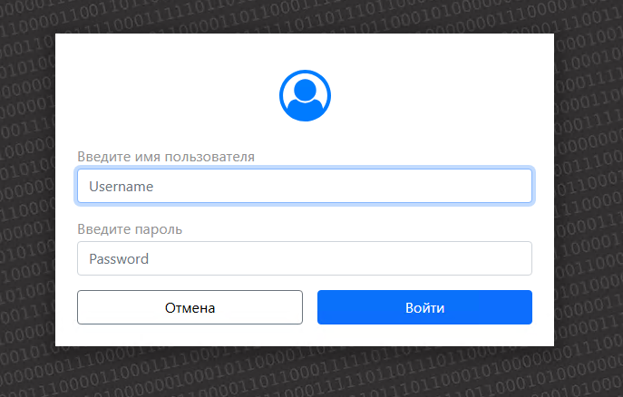
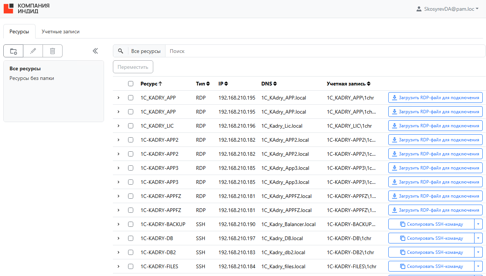
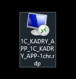
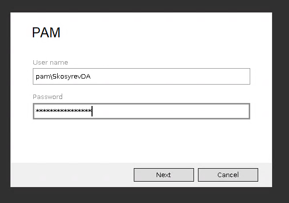

1. Для генерации и скачивания файлика Indeed заходим в браузер на сервере 192.168.100.160

2. Вводим ссылку в поисковую строку [  https://pam-mgmt.pam.loc/uc/](https://pam-mgmt.pam.loc/uc/) . Для удобства можно добавить сайт в закладки браузера.

3. Откроется форма ввода логина и пароля.

4. {width=687px height=438px}

    

5. Откроется главная страница с доступным ресурсами. **Если ресурсы на данной странице отсутствуют, тогда ставим задачу в управление командой Скосыреву ДА. Политика ДИТ и ИКТ такова, что доступ ко всему открыть невозможно с точки зрения кибербезопасности.**

6. {width=1313px height=746px}

7. Далее скачиваем файл подключения нажать на кнопку Загрузить RDP-файл для подключения. Обращаю Ваше внимание что Ресурс может повторяться, но учетная запись может быть разной. Это связано с тем что для подключения может использоваться разные учетные записи.

8. {width=155px height=162px}

9. Щелкаем на ярлык, соглашаемся с условиями и вводим учетные данные в формате

pam\\\<логин> и пароль.

{width=581px height=408px}

1. Поздравляю! Вы успешно подключились к серверу.