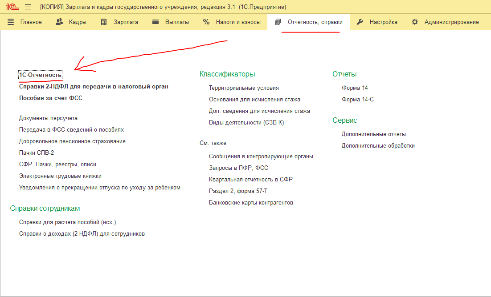
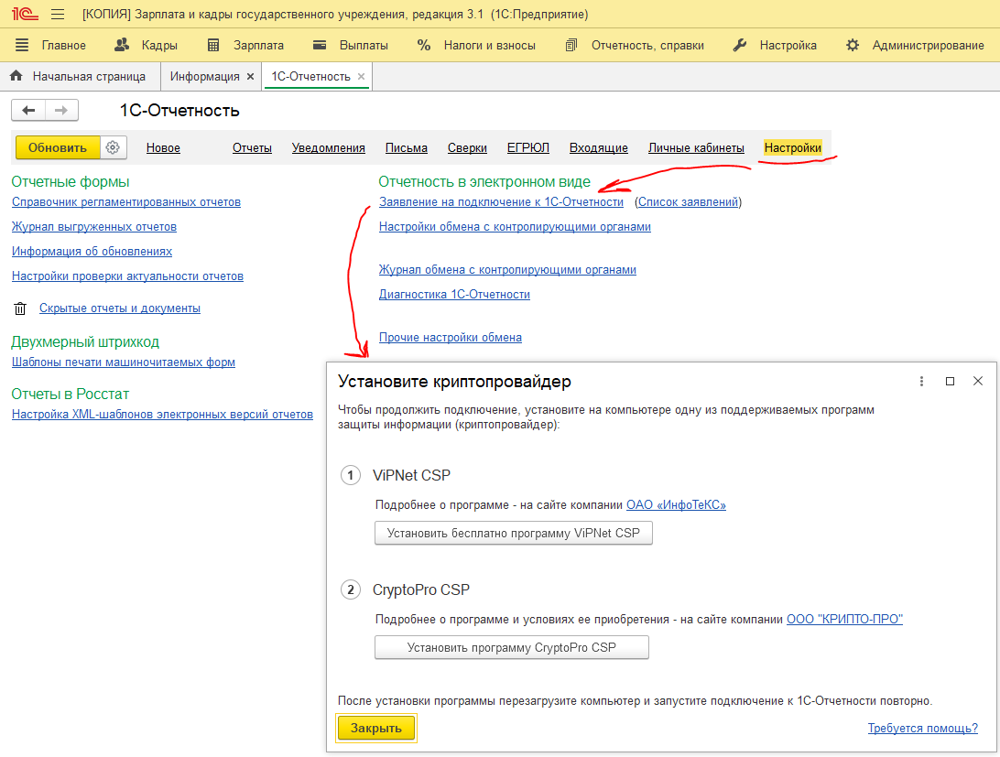
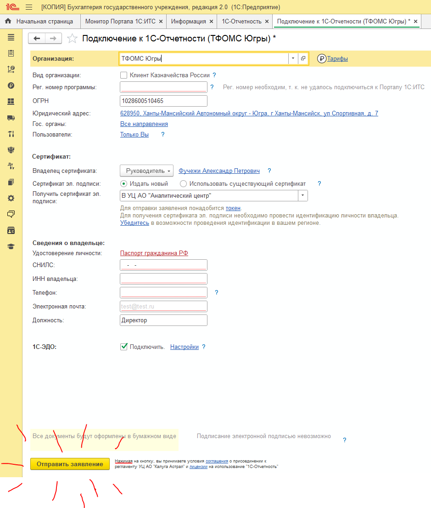

Выбираем **Отчетность, справки** -> **1с-Отчетность**

{width=1102px height=668px}

Выбрать Настройки -> Заявление на подключение к 1С-Отчетности\
Если не установлен криптопровайдер нужно сказать системному администратору чтобы установил, если Вы альтруист-волонтер, можете это сделать сами но скорее всего Вам потребуется пароль от доменной учетки администратора

{width=1092px height=827px}

Бухгалтер заполнят все необходимые сведения, выбираем ЭЦП и нажимаем кнопку **отправить**

После отправки идем к Евгению Усольцеву и просим подтвердить письмо на портале

Продолжение следует…

{width=939px height=1105px}